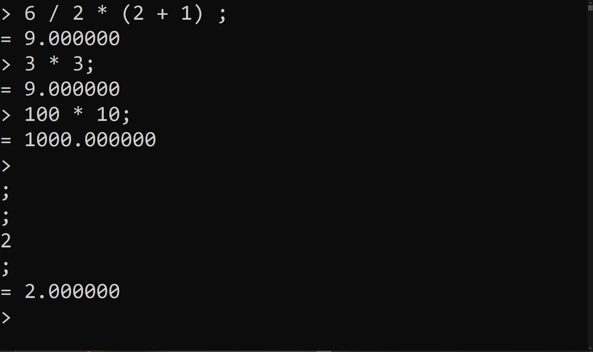

# zcalculator
An implementation of a simple calculator. It can evaluate expressions containing the four main arithmetic operations and parentheses. It achieves these through operator precedence.

## Note

The main reference which was used with this project was 'Programming: Principles and Practice Using C++' by Bjarne Stroustrup. It taught important concepts such as parsing, expression evaluation, grammer, and more.

## Demo 

